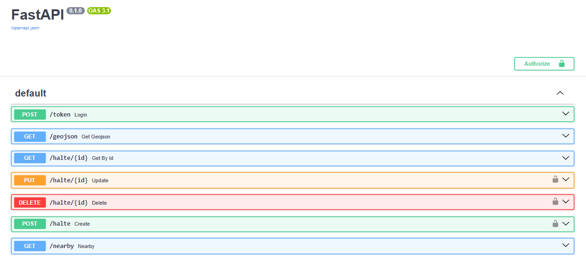
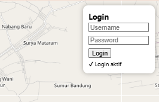
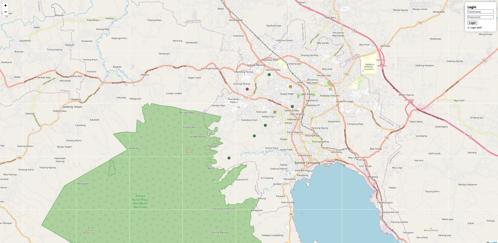
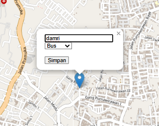
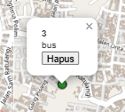

# 🌍 WebGIS Fasilitas Publik (Fullstack)

---

## ⚙️ Cara Setup dan Menjalankan Aplikasi

### 🔧 1. Backend (FastAPI)

Masuk ke folder backend  
cd webgis-api  

Aktifkan virtual environment  
venv\Scripts\activate  

Install dependency  
pip install fastapi uvicorn psycopg2-binary python-jose  

Jalankan server  
uvicorn main:app --reload  

Akses API (Swagger UI)  
http://127.0.0.1:8000/docs  

---

### 🗄️ 2. Setup Database (PostGIS)

Buat database  
CREATE DATABASE sig_prak5;  

Aktifkan PostGIS  
CREATE EXTENSION postgis;  

Buat tabel  
CREATE TABLE halte (
    id SERIAL PRIMARY KEY,
    nama TEXT,
    jenis TEXT,
    geom GEOMETRY(Point, 4326)
);

---

### 🌐 3. Frontend (React)

Masuk ke folder frontend  
cd webgis-frontend  

Install dependency  
npm install  

Jalankan aplikasi  
npm start  

Buka di browser  
http://localhost:3000  

---

## 🔑 Login Aplikasi

Gunakan akun berikut:

Username: admin  
Password: 123  

Klik tombol Login di pojok kanan atas.

---

## 🚀 Cara Menggunakan Aplikasi

### 📍 Menampilkan Data
Data otomatis tampil saat aplikasi dibuka.  
Marker berwarna sesuai jenis:
- 🔴 BRT  
- 🟢 Bus  
- 🟠 Angkot  

### ➕ Menambahkan Data
Klik di peta → isi nama dan jenis → klik Simpan → marker langsung muncul.

### ✏️ Mengedit Data
Klik marker → klik Edit → ubah data → klik Simpan.

### ❌ Menghapus Data
Klik marker → klik Hapus → data langsung hilang.

---

## 📡 Endpoint API

POST /token → Login  
GET /geojson → Semua data  
GET /halte/{id} → Detail data  
POST /halte → Tambah data  
PUT /halte/{id} → Update data  
DELETE /halte/{id} → Hapus data  
GET /nearby → Query spasial  

---

## 📸 Screenshot yang Harus Diambil (WAJIB)

1. Swagger API  
   ()

2. Login Berhasil  
   ()

3. Tampilan Peta  
   ()

4. Tambah Data  
   ()

5. Hapus Data  
   ()

---
